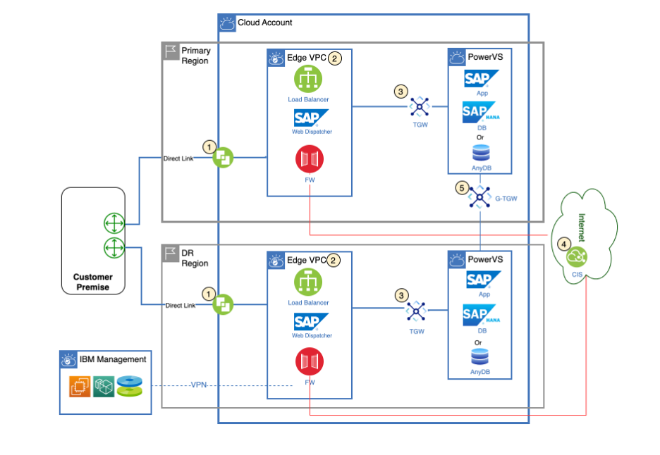
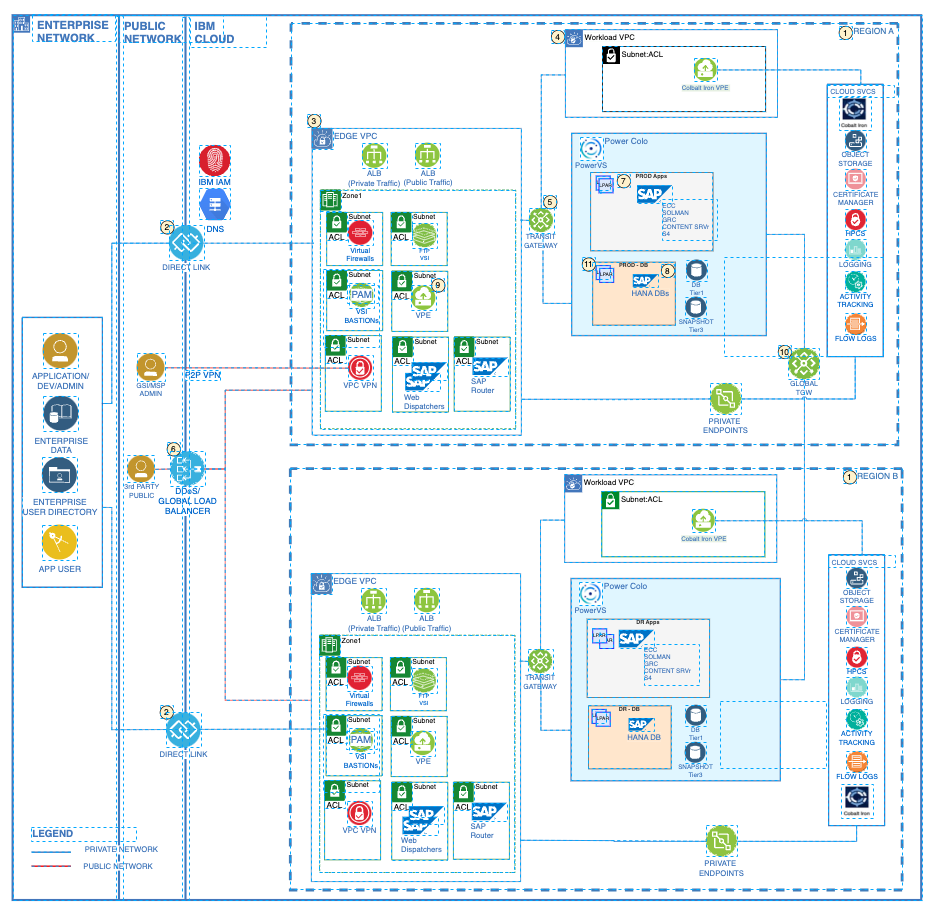
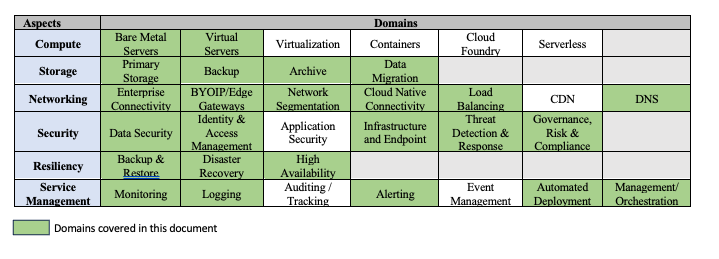

---
copyright:
  years: 2024
lastupdated: "2024-01-12"

subcollection: pattern-sap-on-powervs

keywords:
# The release that the reference architecture describes

authors:
  - name: Doug Eppard

version: 1.0

deployment-url:

docs: https://cloud.ibm.com/docs/pattern-sap-on-powervs

content-type: reference-architecture
---
{{site.data.keyword.attribute-definition-list}}

# SAP on Power Virtual Server
{: #sap-on-powervs}
{: toc-content-type="reference-architecture"}
{: toc-version="1.0"}

The primary region supports Production workloads on Power Virtual Server. The secondary region supports nonproduction and disaster recovery workloads should the customer have DR requirements. The components deployed to the Edge VPC provide security functions and resource isolation to the IBM Cloud workloads.

This is a baseline solution pattern containing the design and architecture decisions for an SAP deployment on IBM Cloud Power Virtual Server to meet the common requirements provided in prior sections. Actual client solutions will depend on specific client requirements.

Figure 1 illustrates a high-level summary of the Use Case, an SAP Single-zone, multi-region deployment on IBM Cloud PowerVS.  The Primary Region supports Production workloads on PowerVS. The Secondary Region supports non-Production and Disaster Recovery workloads should the customer have DR requirements. The components deployed to the VPC Landing Zone provide security functions and resource isolation to the IBM Cloud workloads.

## Architecture Diagram
{: #architecture-diagram}

{: caption="Figure 1. SAP Single-zone, multi-region deployment on IBM Cloud PowerVS" caption-side="bottom"}

1. Client network connectivity from on-premises is accomplished through Direct Link access. Management network connectivity is accomplished through site-to-site VPN.

2. A VPC Landing Zone (Edge VPC) is deployed which contains routing and security functions and optional management components for backup, monitoring and user management.

3. Transit Gateway to Power Virtual Server hosting the SAP application and databases 

4. Public connectivity also routes through Cloud Internet Services (CIS) which can provide global load balancing, failover and DDoS services, then routes to the VPC Landing Zone

5. Global Transit Gateway connecting the PowerVS environment across regions to facilitate replication for DR purposes.

Figure 2 illustrates a detailed network and component architecture for a single-zone, multi-region deployment to facilitate disaster recovery.

{: caption="Figure 2. A single-zone, multi-region deployment to facilitate disaster recovery" caption-side="bottom"}

### Architecture description
{: #architecture-description}

1.	Two separate IBM Cloud regions, one for Primary workload and the other for Disaster Recovery. If Cost Optimized Disaster Recovery is considered, some Non Production systems may share the same compute with Disaster Recovery systems. 
2.	Enterprise network connectivity from On-premise to IBM Cloud is accomplished through Direct Links. 
3.	A VPC Landing Zone (Edge VPC) is deployed which contains routing and security functions.  For security purposes, all ingress and egress traffic will route through the VPC Landing Zone.  It contains a Bastion host (jump), Firewalls providing advanced security functions and the SAP router and SAP Web Dispatcher.  
4.	Besides Power Workloads in Power workspace, x86 workloads may be implemented in a Workload VPC. To backup Power workloads, Secure Automated Backup with Compass by Cobalt Iron is implemented. The private end point for this backup service is located in VPC. 
5.	VPCs are connected to Power workspace through a local Transit Gateway 
6.	Public connectivity routes through Cloud Internet Services which can provide global load balancing, failover, and DDoS services, then routes to the VPC Landing Zone
7.	SAP workloads may be hosted on redundant SAP certified LPARS in PowerVS 
8.	SAP Application and SAP HANA should be placed on SAP certified LPARs within the zone with proximity considered
9.	Virtual Private endpoints in VPCs are used to provide connectivity to cloud native services 
10.	Global Transit Gateway connecting Power workspace across regions for data replication purposes between the two regions.
11.	To achieve 99.95% infrastructure availability, multiple LPARs in the same placement group within a zone can be implemented

## Design scope
{: #design-scope}

Design decisions that need to be considered for an end-2-end SAP on PowerVS deployment and which are covered in this accelerator include:

- **Compute:** Bare Metal and Virtual Servers
- **Storage:** Primary, Backup, and Archive
- **Networking:** Enterprise Connectivity, Edge Gateways, Segmentation and Isolation, Cloud Native Connectivity and Load Balancing
- **Security:** Data, Identity and Access Management, Infrastructure and Endpoint, Threat Detection and Response
- **Resiliency:** Backup and Restore, Disaster Recovery, High Availability
- **Service Management:** Monitoring, Logging, Alerting, Management/Orchestration

The Architecture Framework provides a consistent approach to design cloud solutions by addressing requirements across a set of "aspects" and "domains", which are technology-agnostic architectural areas that need to be considered for any enterprise solution. See Introduction to the Architecture Framework for more details.

{: caption="Figure 3. Domains that are covered in this solution" caption-side="bottom"}

## Requirements
{: #requirements}

The following represents a baseline set of requirements which we believe are applicable to most clients and critical to a successful SAP deployment.

| Aspect         | Requirement                                                         |
|---------------------------------|----------------------------------------------------------------------------------------------------------------------------------------------------------------------------------------------------------------------------------------|
| Compute            | SAP certified SAP and HANA profiles (SAP note 2855850 and 29475779)                                                                                                                                                                                                                                    |
|                    | VMs that satisfy the SAPS and RAM requirements                                                                                                                                                                                                                            |
|                    | Scale-up and Scale-out                                                                                                                                                                                                                                                                                                                                                                                                                                   |
| Storage            | Primary storage                                                                                                                                                                                                                                                                                        |
|                    | Shared file storage                                                                                                                                                                                                                                                                     |
|                    | Performance of storage to meet I/O requirements                                                                                                                                                                                                                                                                                 |
| Network           | Enterprise connectivity to customer data center(s) to provide access to applications from on-prem                                                                                                                                                                                                        |
|                    | Map and convert existing customer SAP Network functionality into IBM Cloud and PowerVS networking services                                                                                                                                                                                                                                                                                                    |
|                    | Migrate/Redeploy customer IP addressing scheme within the IBM Cloud environment or combine the existing schema with one in IBM Cloud in hybrid cloud scenarios                                                                                                                                                                                                                             |
|                    | Provide network isolation with the ability to segregate applications based on attributes such as data classification, public vs internal apps and function                                                                                                                                                                                                                                                                                                                     |
| Security         | Provide data encryption in transit and at rest                                                                                                                                                                 |
|                    | Migrate customer IDS/IAM Services to target IBM Cloud environment                                                                                                                                                                                                                                                                  |
|                    | Retain the same firewall and network isolation rules across existing DCs                                                                                                                                                                                                                               |
|                    | Firewalls and network isolation rules must be restrictively configured to provide advanced security features and prevent all traffic, both inbound and outbound, except that which is specifically required, documented, and approved, and include IPS/IDS services                                                                                                                                                                                                                               |
| Resiliency         | Backup & Restore SAP applications and databases                                                                                                                                                                                                                                                                        |
|                    | High availability for SAP applications and databases with infrastructure SLA up to 99.99                                                                                                                                                                                                                                 |
|                    | Multi-region capability to support a disaster recovery strategy and solution leveraging IBM Cloud infrastructure DR capabilities to achieve required RTO/RPO                                                                                                                                                                                                                                        |
| Service Management  | Provide Health and System Monitoring with ability to monitor and correlate performance metrics and events and provide alerting across applications and infrastructure                                                                                                                                                                                                                                                                        |
|                    | Ability to diagnose issues and exceptions and identify error sources                                                                                                                                                                                                                                 |
|                    | Automate management processes to keep applications and infrastructure secure, up to date, and available                                                                                                                                                                                                                                        |
| Other              | IBM Cloud IaaS will be deployed to support SAP and surrounding non-SAP workloads                                                                                                                                                                                                                                                                         |
|                    | Migrate SAP and Non-SAP workloads from existing data center to IBM PowerVS                                                                                                                                                                                                                                 |
|                    | Rise and Non-Rise considerations                                                                                                                                                                                                                                        |
|                    | The customer does not want to adopt [RISE](https://www.ibm.com/consulting/rise-with-sap?utm_content=SRCWW&p1=Search&p4=43700077624079785&p5=e&gclid=EAIaIQobChMIr9bRlt7LgQMVJdHCBB0cewwcEAAYASAAEgIVgfD_BwE&gclsrc=aw.ds) at this time but wants to consider a Cloud deployment solution that would facilitate a future RISE transformation |
{: caption="Table 1. Requirements" caption-side="bottom"}

## Components
{: #components}

| Aspects                       | Solution components                                                                                                                                                                                    | How the component is used                                                              |
|-------------------|--------------------------------------------------------------------------------------------------------------------------------------------|-------------------------------------------------------------------------------------------------------------------|
| Compute                            | [Power Systems Virtual Server VPC VSIs](https://cloud.ibm.com/docs/sap?topic=sap-fast-path-site-map-power-vs )                                                                                                                                        | SAP NetWeaver, HANA, AnyDB and other Power Workloads are implemented on IBM Power Systems Virtual Servers

Gen2 VSIs for Bastion Host and some Internet facing SAP components in VPC Landing Zone (Edge VPC)

x86 workloads, if any, are implemented with Gen2 VSI in Workload VPC                                                 |
| Storage                            | FlashSystem Storage                                                                                                                                                                | Application and Database primary storage on different Tiers.               |
|                                    | [Cloud Object Storage](https://cloud.ibm.com/docs/cloud-object-storage?topic=cloud-object-storage-about-cloud-object-storage)                                                                 | Backup and archive, application logs, operational logs, and audit logs                                       |
|                                    | [Block storage](https://cloud.ibm.com/docs/vpc?topic=vpc-block-storage-about&interface=ui)                                                                                                                  |                                                                                                             |
| Networking                         | [VPC Virtual Private Network (VPN)](https://cloud.ibm.com/docs/iaas-vpn?topic=iaas-vpn-getting-started)                                                                                                     | Remote access to manage resources in a private network                                                        |
|                                    | [Virtual Private Gateway & Virtual Private Endpoint (VPE)](https://cloud.ibm.com/docs/vpc?topic=vpc-about-vpe)                                                                                | For private network access to Cloud Services, for example Key Protect, Cloud Object Storage, and so on.                                   |
|                                    | [Cloud Internet Services (CIS)](https://cloud.ibm.com/docs/cis?topic=cis-getting-started)                                                                                                                   | Public Load balancing and DDoS of web servers traffic across zones in the region                            |
|                                    | [DNS Services](https://cloud.ibm.com/docs/dns-svcs?topic=dns-svcs-about-dns-services)                                                                                                         | Domain Naming System services                                                                               |
|                                    | [VPCs and subnets](https://cloud.ibm.com/docs/vpc?topic=vpc-about-subnets-vpc&interface=ui)                                                                                                                 | Network Segmentation/Isolation                                                                              |
|                                    | [Transit Gateway](https://cloud.ibm.com/docs/transit-gateway?topic=transit-gateway-about)                                                                                                                   | Connects across VPC, PowerVS, and Classic                                                                    |
|                                    | [IBM Cloud Application Load Balancer](https://cloud.ibm.com/docs/vpc?topic=vpc-load-balancers-about) (ALB) or Network Load Balancer (NLB)                                                                                                 | Load balancing workloads across multiple workload instances over the private network                        |
|                                    | SAP Web Dispatcher                                                                                                                                                                                          |                                                                                                             |
| Security                           | [Block Storage encryption](https://cloud.ibm.com/docs/vpc?topic=vpc-mng-data&interface=ui) with provider keys                                                                                 | Block Storage Encryption at rest                                                                            |
|                                    | Cloud Object Storage Encryption                                                                                                                                                                             | Cloud Object Storage Encryption at rest                                                                     |
|                                    | PowerVS FlashSystem storage encryption                                                                                                                                                                              | Power VS uses IBM FlashSystem Storage with AES-256 (Advanced Encryption Standard) hardware-based encryption |
|                                    | HANA Data Volume Encryption (DVE)                                                                                                                                                                           | HANA Database Encryption at rest                                                                            |
|                                    | [IAM](https://cloud.ibm.com/docs/account?topic=account-cloudaccess)                                                                                                                           | IBM Cloud Identity & Access Management                                                                      |
|                                    | [Subnets](https://cloud.ibm.com/docs/account?topic=account-cloudaccess)                                                                                                                           | INetworking segregation                                                                       |
|                                    | Privileged Identity and Access Management                                                                                                                                                                   | BYO Bastion host (or Privileged Access Gateway) with PAM SW deployed in Edge VPC                            |
|                                    | [BYO Bastion Host on VPC VSI with PAM SW](https://cloud.ibm.com/docs/framework-financial-services?topic=framework-financial-services-vpc-architecture-connectivity-bastion-tutorial-teleport) | Remote access with Privileged Access Management                                                             |
|                                    | [Virtual Private Clouds (VPCs), Subnets, Security Groups, ACLs](https://cloud.ibm.com/docs/vpc?topic=vpc-getting-started)                                                                     | Core Network Protection and isolation                                                                       |
|                                    | Isolated PowerVS LPARs                                                                                                                                                                                      |                                                                                                             |
|                                    | PowerVS LPARs                                                                                                                           | Logically Isolated on hardware and segregated with VLAN configuration                                                                      |
|                                    | [Cloud Internet Services (CIS)](https://cloud.ibm.com/docs/cis?topic=cis-getting-started)                                                                                                                   | DDoS protection and Web App Firewall                                                                        |
|                                    |Choose one of the following: \n  - [Fortigate](https://cloud.ibm.com/catalog/content/ibm-fortigate-AP-HA-terraform-deploy-5dd3e4ba-c94b-43ab-b416-c1c313479cec-global) \n  - [Palo Alto](https://cloud.ibm.com/catalog/content/ibmcloud-vmseries-1.9-6470816d-562d-4627-86a5-fe3ad4e94b30-global) \n  - [Juniper vSRX](https://cloud.ibm.com/catalog/content/jnpr-nextgen-fw-vsrx-74b4b3ba-2a05-460d-afba-98e4d012f53a-global)  \n  - [Checkpoint Cloud Guard](https://cloud.ibm.com/catalog/content/check-point-cloudguard-network-security-firewall-with-threat-prevention-1f1f50fe-e41d-4715-9ba6-02d37d76596c-global)                                                     |IPS/IDS protection at all ingress/egress \n Unified Threat Management (UTM) Firewall                                                                |
| Resiliency                         | HANA System Replication (HSR)                                                                                                                                                                               | Provide 99.95% availability for HANA DB                                                                     |
|                                    | Secure Automated Backup with Compass                                                      | Backup & recovery.                                                           |
|                                    | Pacemaker based cluster with Red Hat Enterprise Linux HA Add-On, or with SUSE Linux High Availability Extension                                                 | High Availability clustering management.                                                           |
|                                    | AnyDB Database native data replication and clustering Extension                                                 | For AnyDB HA and DR.                                                           |
|                                    | [IBM Storage Protect](https://cloud.ibm.com/media/docs/downloads/power-iaas/PowerVS_AIX_Backup_Performance_Best_Practices_and_Guidelines_v1_0_03012022.pdf)                                                 | Backups and restores for images and file systems.                                                           |
|                                    | [GRS](https://cloud.ibm.com/docs/power-iaas?topic=power-iaas-getting-started-GRS)                                                                                                                           |                                                                                                             |
|                                    | DBACOCKPIT, HANACOCKPIT, backint                                                                                                                                                                            | SAP HANA backups                                                                                            |
|                                    | Native database backup capabilities                                                                                                                                                                         | AnyDB backups                                                                                               |
| Service Management (Observability) | IBM Cloud Infrastructure Monitoring based on SysDig                                                                                                                | Real time visibility                                                                             |
|                                    | [IBM Cloud Logs](https://cloud.ibm.com/docs/cloud-logs)                                                                                                              | Manage operating system logs, application logs, and platform logs                                                                             |
|                                    | SAP Solution Manager, FRUN                                                        | SAP Native monitoring                                                                            |
{: caption="Table 2. Components" caption-side="bottom"}

As mentioned earlier, the [Architecture
Framework](/docs/architecture-framework?topic=architecture-framework-intro)
is used to guide and determine the applicable aspects and domains for
which architecture decisions need to be made based on customer
requirements. The following sections contain the considerations, and
architecture decisions for the aspects and domains that are in scope for
this solution pattern.
